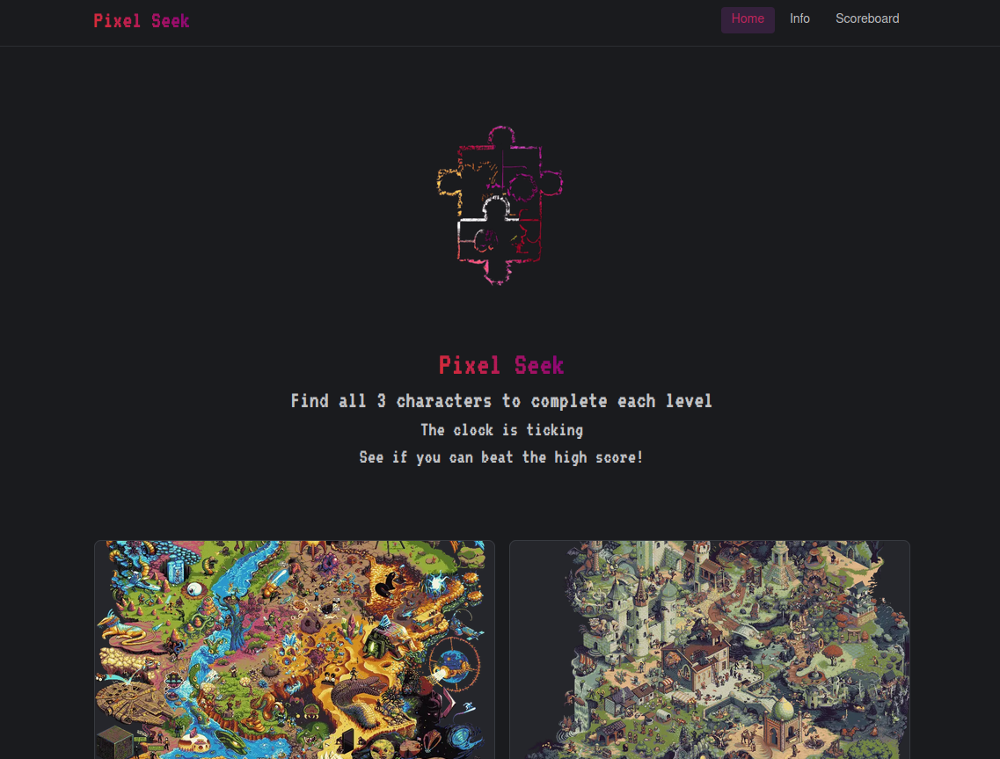

# Photo Tagging Game

A seek & find photo tagging game. Built with React, Redux & Firebase.

[Demo here](https://casphototagginggame.netlify.app/)

## Tech Used
* Typescript
* React, React Router
* Firebase
* Redux Toolkit
* Mantine (including Mantine hooks & forms for validation)
* NPM & Vite (SWC) for build
* Vitest (test runner) & React Testing Library for testing
* React Image Magnifiers

## Features
* Firebase back-end stores character co-ordinates & handles a writeable scoreboard.
* Pop-up message displays feedback on the accuracy of each click.
* Magnifier zoom on hover
* Responsive

## Thoughts
This was a ton of fun and I learnt a lot! Here's a quick summary:
* Typescript: This is amazing and by far my favourite recent addition to the tech stack. The more I read, the more I realise how important it is to make my code easy to debug, document and update. Although using Typescript meant a ton more reading of docs (especially Redux), the way it synchronises with auto-complete is worth it alone! I think I'll stick to using this in future. The extra time spent learning how Typescript integrates with each 3rd party library I use seems easily worth it with all the extra safety it provides.
* Redux Toolkit- I've used Redux without this before and also Reacts internal state management equivalents (useReducer with context/useContext). Redux Toolkit just makes everything easy and has less boilerplate. I like how it integrates Immer although it does feel a little weird creating Reducers but not shallow copying state!  
I'm going to look into Recoil or Zustand next as these seem even simpler/cleaner (unless I need middleware, in which case it seems Redux is still the way to go).
* Firebase- Simple, easy to use and understand. Solid docs.
* Mantine- I think this is my favourite component library. It has more pre-built components than Material (the free version) and is very easy to modify. Feels very comparable to Chakra UI. The hooks are an awesome addition. 

## Possible Improvements
* I'm planning to do a whole lot more reading on Typescript. I've found my experience using it so far to be extremely useful but I'd like to work on organising my interfaces/types better.
* The way I setup Redux ended up utilising just 1 slice. I'm not sure this is the preferred way of organising things as it seems I could have split this into a few different parts (state for the header, pop-up menu and general game). I've found a few Githubs for companies that code in the open and plan on studying these for tips.
* I plan on focusing on learning to optimise the images I use. I've already spent time minifying them before uploading (I compress them and convert larger images to WEBP). However, I've been reading the docs for some of the header-less CMS providers and most of them serve several different image sizes. For my next project I plan on trying something like this.

## Credits
* All pixel art created by the folks at the [Pixeljoint](https://pixeljoint.com/) forum